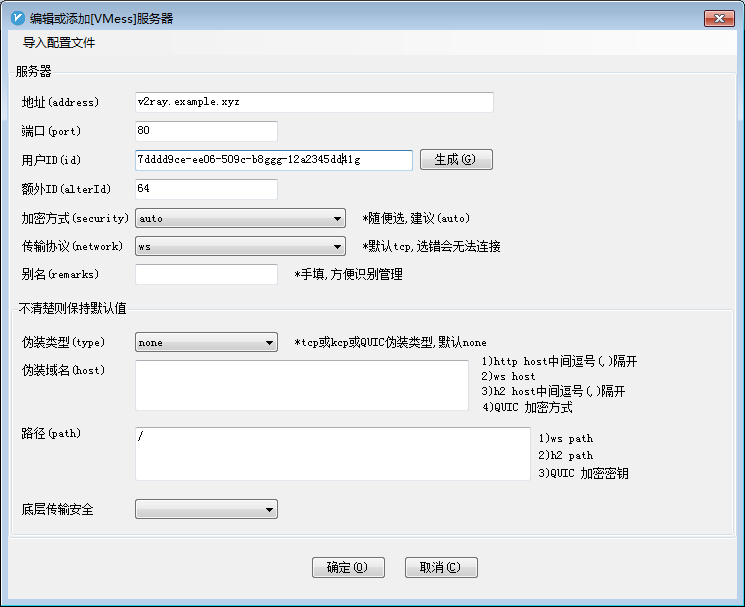
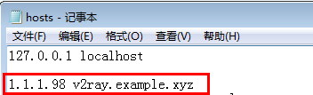

# v2ray+Cloudflare 用户修复指南

## 前提

通常用户可能会拿到

- 一段加密的文字
- 一个链接
- 一个二维码
- 其他场景...

最终到你的 VPN 或者代理软件上，都是类似下图所示的配置信息

_截图中的信息仅作示范，无法使用_

其中的地址 `v2ray.example.xyz` 通常指向 [cloudflare][cloudflare] 管理的节点，节点的质量决定了 VPN 的质量。庆幸的是，用户自己可以决定 `v2ray.example.xyz` 指向哪个节点，从而决定自己所用的 VPN 的质量。

_**本文的 `v2ray.example.xyz` 仅仅作为示范，具体都要使用用户自己的 VPN 的域名**_

## 切换节点

[cloudflare][cloudflare] 支持的节点很多，可以参考[这里](./cloudflareNodes/allNodes.md)，由于节点太多，个人建议在 `1.1.1.1-1.1.1.254` 里进行选择就可以了，简单来说，如果你觉得你的 VPN 挂了，
- 可以请求 VPN 的维护者把 `v2ray.example.xyz` 指向新的节点，维护者改完后，过一段时间，你这边会生效（如果你会清除本机的 DNS 缓存的话，时间会更短，通常在几秒~几个小时）
- **个人推荐**：自己把本机的 `v2ray.example.xyz` 指向新的节点，**改完即生效**。

那么，如何把本机的 `v2ray.example.xyz` 指向新的节点呢？请[百度如何修改本机 hosts 文件](https://www.baidu.com/s?wd=%E5%A6%82%E4%BD%95%E4%BF%AE%E6%94%B9%E6%9C%AC%E6%9C%BA%20hosts%20%E6%96%87%E4%BB%B6)

至于改成哪个节点，对于小白，你可以随意尝试，`1.1.1.*` 中的任何一个，只要注意**最后一个数是1-254 之间的整数**就行。

譬如，作为 windows7 用户，我修改 `C:\Windows\System32\drivers\etc\hosts` 文件，改成

保存后，就可以试试 VPN 是不是又重新复活了，如果不行的话，再换几个，尝试了多个节点之后还不行的话，请联系维护者。

[cloudflare]: http://cloudflare.com/
