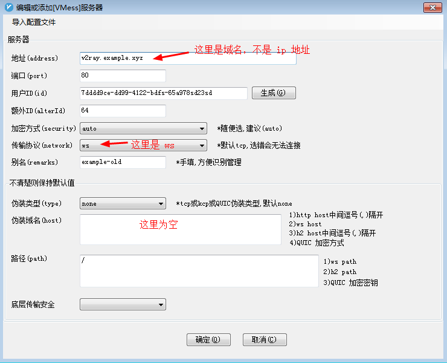

# v2ray+Cloudflare 用户修复指南

## 目的

本文试图告诉 v2ray+Cloudflare 科学上网用户，在代理不行的时候，如何进行自我修复。

## 前提

通常此类用户可能会拿到的东西是

- 一段加密的文字
- 一个链接
- 一个二维码
- 其他场景...

最终到你的 VPN 或者代理软件上，以 `windows` 平台的 `v2rayN` 为例，如果是类似下图所示的配置信息

请参考下图作一些修改：

_截图中的信息及本文的 `v2ray.example.xyz` 仅为示范，具体要用用户自己的 VPN 的设置_

如果是 Mac 上的 `v2rayX`, 操作稍有不同，大概字段应该对得上，上图的`伪装域名`字段，可能在`transport settings` 里面的 `WebSocket`。本人未曾验证过，如有小伙伴验证成功，欢迎截图发我。

如果你的 VPN 软件，无法做上述的修改，那么请看[通过 hosts 切换节点](#通过hosts切换节点)。

如果你的 VPN 软件，可以做上述的修改，**改完即生效**。以后如果不行了，就换一下第一行地址字段的最后一位（只要是 1-254 中间的整数就行），如果换了几次都不行，请联系管理员。

_注意，这个修改，只会作用于当前设备，其他的设备不会受影响。_

完。

## 通过hosts切换节点

如果无法做上述修改，可以把自己本机的 `v2ray.example.xyz` 指向新的节点，**改完即生效**

那么，如何把本机的 `v2ray.example.xyz` 指向新的节点呢？请[百度如何修改本机 hosts 文件](https://www.baidu.com/s?wd=%E5%A6%82%E4%BD%95%E4%BF%AE%E6%94%B9%E6%9C%AC%E6%9C%BA%20hosts%20%E6%96%87%E4%BB%B6)

至于改成哪个节点，对于小白，你可以随意尝试，`1.1.1.*` 中的任何一个，只要注意**最后一个数是1-254 之间的整数**就行。

譬如，作为 windows7 用户，我修改 `C:\Windows\System32\drivers\etc\hosts` 文件，改成

保存后，就可以试试 VPN 是不是又重新复活了，如果不行的话，再换几个，尝试了多个节点之后还不行的话，请联系维护者。